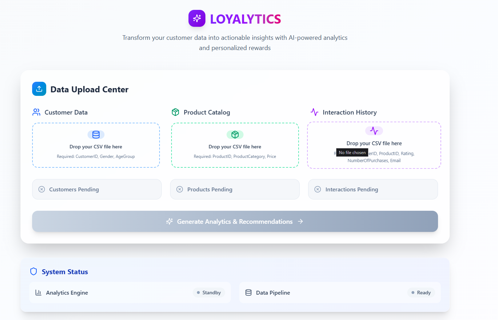

# 🎯 Loyalytics

Loyalytics is an AI-powered customer analytics platform that transforms raw customer data into personalized loyalty rewards. Businesses struggle with generic loyalty programs that fail to engage customers effectively. Our solution analyzes customer purchase patterns, preferences, and behavior to automatically generate targeted reward recommendations that increase retention rates and drive repeat purchases. Key Features: Upload customer, product, and interaction data via CSV files AI-powered analysis of purchase patterns and customer behavior Automated generation of personalized discount codes and product recommendations Analytics dashboard with key performance metrics Export capabilities for email marketing campaigns Personalized Recommendations of rewards for each customer, rewarding customer interaction and continued usage

To accurately provide data insights and generate tailored loyalty rewards for your customers, Loyalytics requires certain data from your company. Namely:

1. Customer Data for each Customer
    - CustomerID
    - Gender
    - Age Group
2. Product Detail for each Product
    - ProductID
    - Product Category
    - Price
3. Transaction and Interaction information:
    - CustomerID of purchasing Customer
    - ProductID of purchased product
    - Quantity Purchased (Number of Purchases)
    - Email of Purchasing Customer

---

## 🚀 Demo

> 🔗 Live site: https://lifehack-loyalytics.vercel.app/

---

## 📸 Preview

## 💡 Inspiration

Many small and medium businesses lack the data expertise to personalize customer engagement at scale. Loyalytics bridges that gap with an intuitive interface and powerful AI recommendations, allowing any business to run effective loyalty campaigns in just a few clicks.

---

## 🧠 How It Works

1. Upload your `customers.csv`, `products.csv`, and `interactions.csv`
2. Our backend trains a hybrid recommendation model using **LightFM**
3. The system analyzes purchasing and rating behaviors
4. Tailored rewards are suggested per customer
5. With one click, you can send rewards to customers via **SendGrid**

---

## 🛠️ Built With

- **Python** – Backend logic & training pipeline  
- **Flask** – RESTful API for frontend communication  
- **LightFM** – Hybrid recommendation model  
- **React.js** – Interactive frontend UI  
- **Tailwind CSS** – Modern styling  
- **SendGrid API** – Email delivery of rewards  
- **Render** – Full-stack deployment  
- **Pandas & NumPy** – Data manipulation  
- **Dotenv** – Environment variable management

---

## 📈 Future Plans

- Add user login and dashboard history  
- Improve email content personalization  
- Support more data sources beyond CSV  
- Introduce basic A/B testing to track reward effectiveness

---

## 🤝 Team

- **Kai Kiat** – Designed and implemented major parts of the frontend UI using React, ensuring responsive and intuitive user interaction. Contributed to frontend-backend integration and played a key role in debugging layout and state management issues.
- **Jankai** – Led the deployment of the application using Render and handled hosting logistics. Worked on frontend development and linked the frontend with the backend, as well as resolving integration bugs.
- **Xiang Rui** – Led the development of the recommendation engine using the LightFM library, structured backend data processing pipelines, and ensured smooth integration between the model and API endpoints.
- **Nicholas** – Implemented the bulk email dispatch system using SendGrid, Cleaned and structured CSV input data for model training, contributed to backend Flask and helped validate end-to-end functionality.

---
